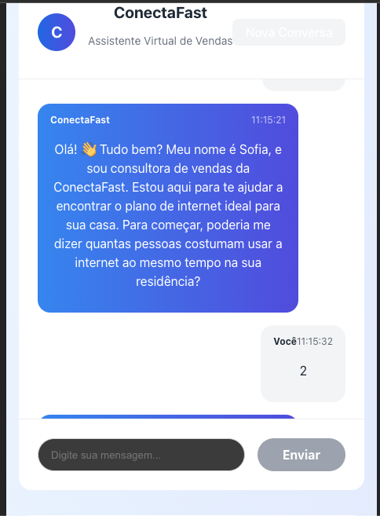

# 💬 ConnectaFast (Vue + NodeJS)

Este é um pequeno projeto de **webchat** feito com **Vue 3** e **NodeJS**.  



---

## 📦 Pré-requisitos

Antes de começar, certifique-se de ter instalado em sua máquina:

- [Node.js](https://nodejs.org/) (versão 16+ recomendada)
- [npm](https://www.npmjs.com/) ou [yarn](https://yarnpkg.com/)

---

## ▶️ Como rodar o projeto

Clone este repositório e instale as dependências:

```bash
git clone https://github.com/erickdesant/webchat
cd webchat
npm install
cd backend
npm install

cd ..
cd frontend
npm install
cd ..
npm run dev


